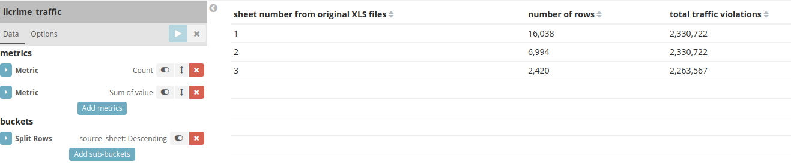
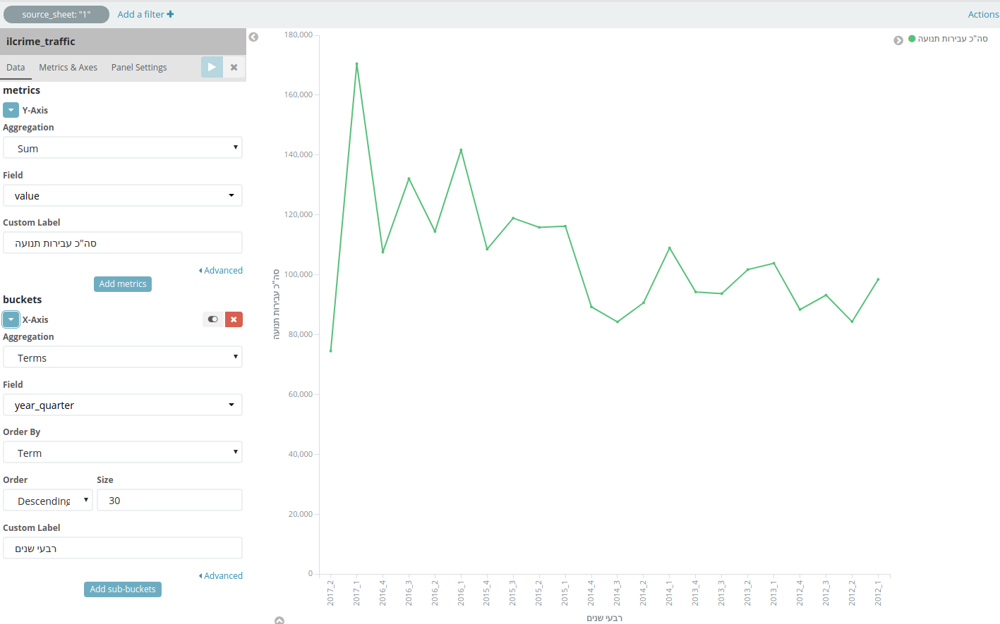
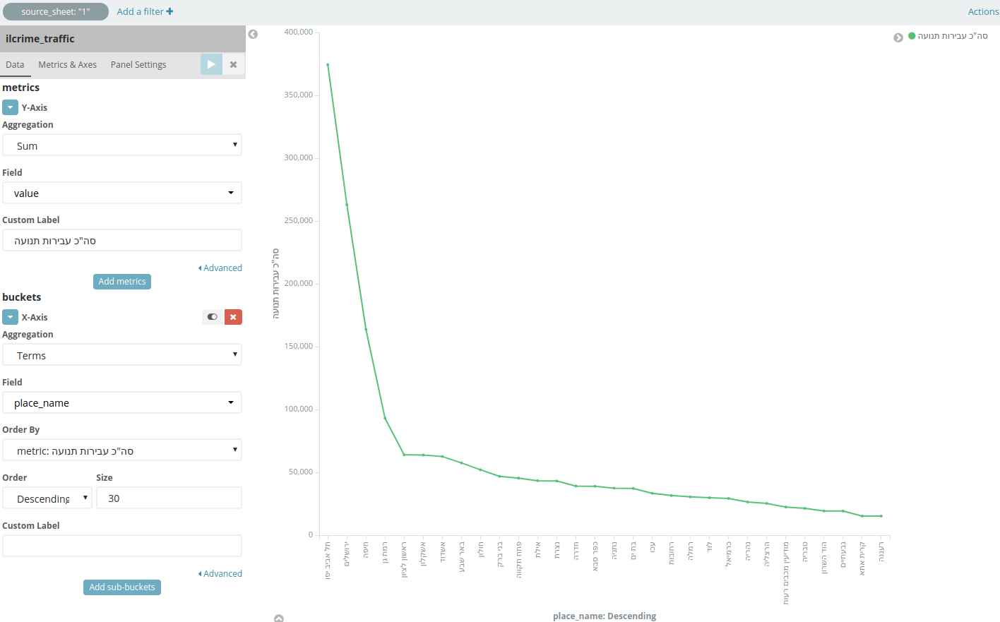

# sources/traffic-2012-2016-partial-2017.xls

Traffic violations data received from FOI requests.

Contains data for years 2012-2016 and partial 2017.

## Overview

Data is duplicated in 3 Excel sheets:

I chose sheet 1 for further investigations - but it's worth to investigate this discrepancy further.

## Traffic violations per quarter year

## Traffic violations per place

